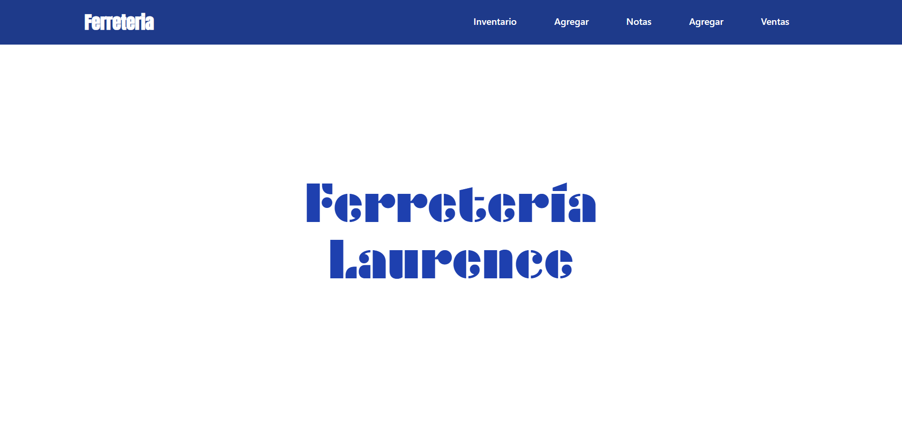
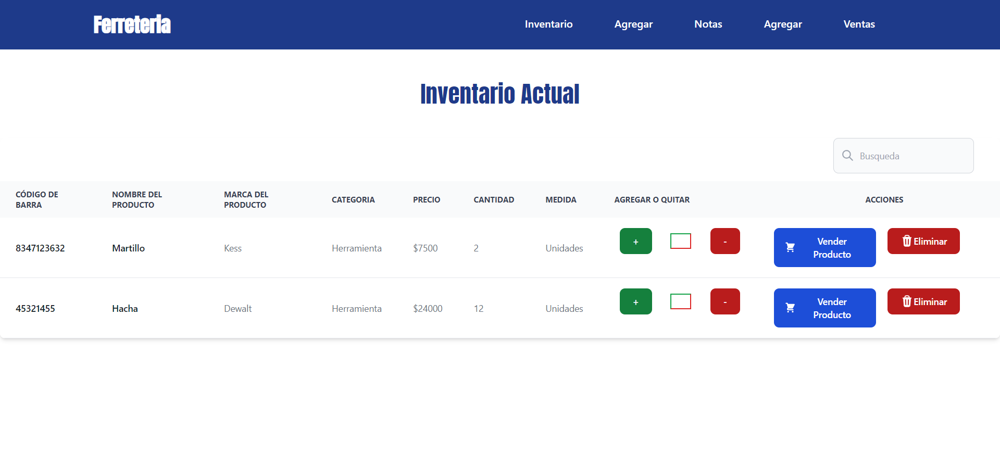
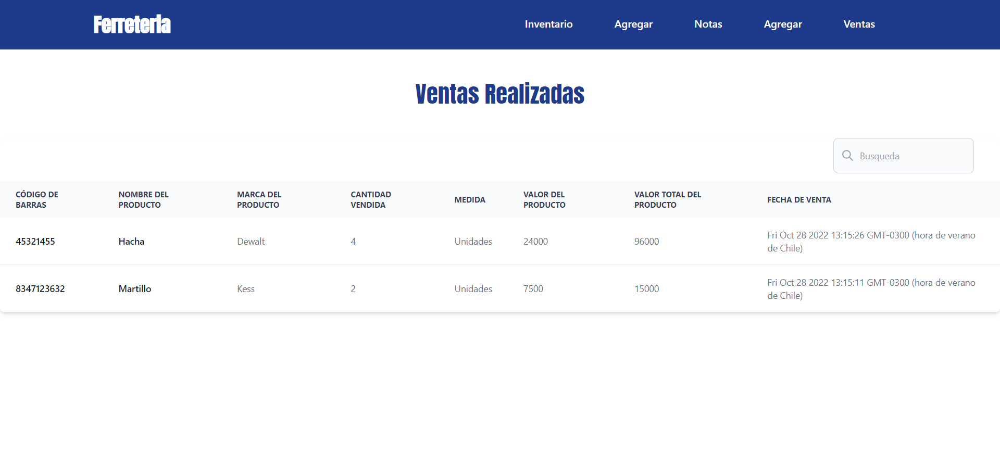

# JS Crud de Ferreteria 
CRUD de inventario para Ferretería creado a partir de Node.js, Express.js y MySQL

## 📖 Leeme
Pequeña aplicación web, en este caso se trata de un CRUD realizado con Node.js, Express.js y MySQL. Además se utilizó TailwindCSS para darle un diseño simple.

Lo que permite esta aplicación es el agregar elementos a un inventario y agendar pequeñas notas.

También cuenta con un registro de las ventas que se han realizado.

## 🆘 Instrucciones

Primeramente debe ingresar al archivo "db" ubicado en /src/ y exportar la base de datos a MySQL de preferencia utilizando Xampp

Luego puede iniciar la aplicación con el comando: "npm run dev"

## ©️ Copyright

**`LICENSE`**: MIT

Check the file [here](./LICENSE)
